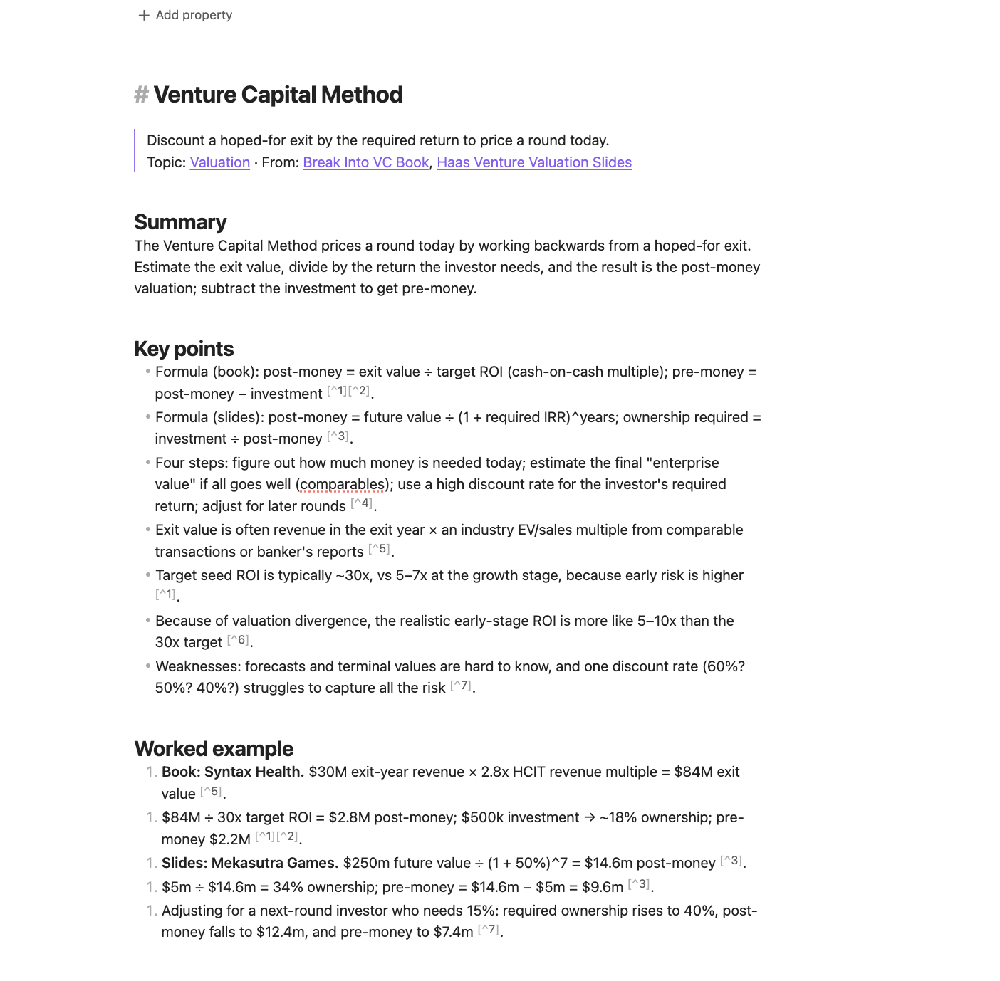
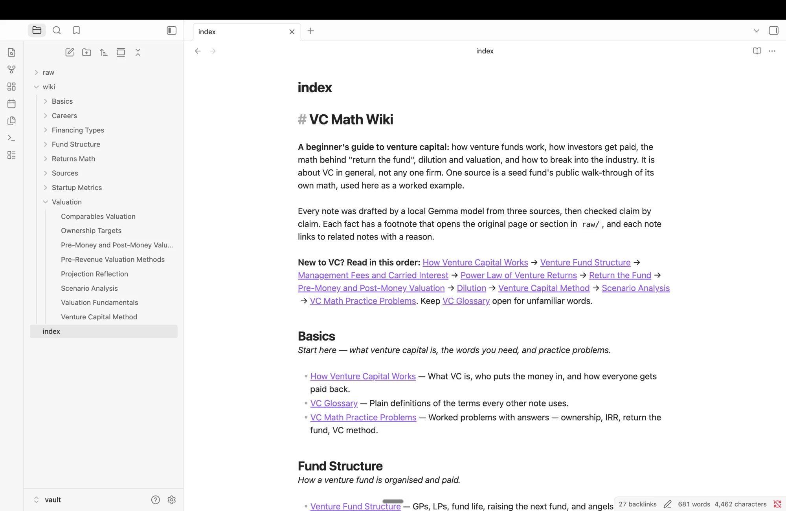
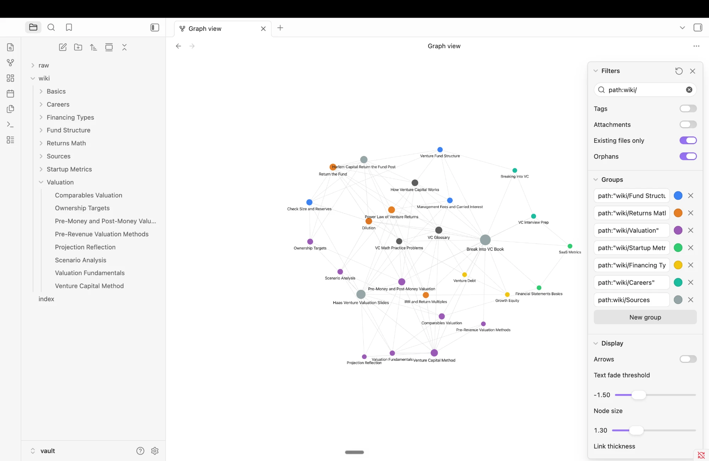

# VC Math Wiki: a beginner's guide to venture capital, as a local-Gemma CLI

A **beginner's guide to venture capital** that you can read in Obsidian or question from the terminal:
- how venture funds work and get paid
- why VCs need a startup that can "return the fund"
- dilution, pre- and post-money valuation, and the VC method
- scenario analysis, startup metrics, and how to break into the industry

It is about **VC in general, not any one firm**. The answers come from three sources I'm studying.
They run on **Gemma 4 E2B (4-bit) locally on a MacBook Air M4, with no internet**.

I wrote the CLI and harness myself (Python, ~2.3k lines in [`wikicli/`](wikicli/)). Libraries only do
model inference (MLX), PDF parsing (pypdf), and YAML.

```
wiki ingest vault/raw                                   # originals -> passages -> Gemma-drafted notes -> index.md
wiki search "return the fund"                           # original passages + page references, no model
wiki ask "How do the partners who run a venture fund get paid?"   # cited answer, or INSUFFICIENT EVIDENCE
wiki chat                                               # "Carry", a study-partner persona with conversation memory
wiki verify                                             # audit every note's numbers against the pages it cites
```

**Jump to:** [Evidence](#evidence) · [Setup](#setup-exact-commands) · [Device & model](#device-model-and-measurements) ·
[Architecture](#architecture-one-question-traced-through-the-code) · [Design choices](#design-choices) ·
[Reflection](#reflection-a-real-failure-and-a-next-step)

### Evidence at a glance

| What | Result | Link |
|---|---|---|
| T1: direct, one source | ✅ "20% and 30% ownership in the Seed round [S1]" | [T1](evidence/ask/T1.md) |
| T2: paraphrased | ◐ fee + 20% carry correct and cited, but omits "about 2%" | [T2](evidence/ask/T2.md) |
| T3: connects two sources | ◐ both sources, both worked examples; misstates one figure (20% vs the slide's 34%) | [T3](evidence/ask/T3.md) |
| T4: unsupported | ✅ INSUFFICIENT EVIDENCE, after a harness fix (the first run invented a cited definition; kept as evidence) | [T4](evidence/ask/T4.md) |
| 8 extra beginner questions | 5 ✅, 2 ◐, 1 ❌ (a false refusal on a paraphrase; the rephrased question answers correctly) | [evidence/ask/](evidence/ask/) |
| Chat / search mode checks | ✅ all 9 boundaries hold; chat's echo of a false "5%" claim was caught and corrected by the harness | [mode-checks.md](evidence/mode-checks.md) |
| Offline run (ingest, 12 ask questions, chat, search, verify, errors) | ✅ all network access denied by the OS for every process | [terminal log](evidence/offline/terminal-log-sandboxed.txt) |
| Retrieval checked before the model | 10 of 12 expected passages found (misses: B3's glossary definition, B8's slides); one chunking fix, one tested-and-rejected experiment | [retrieval-check.md](evidence/retrieval-check.md) |
| Wiki: review + automatic audit | 24 notes reviewed by hand; `wiki verify`: 459 numbers, 0 unsupported | [review log](evidence/wiki-review-log.md) |
| Re-ingest, no duplicates | same 27 files; reviewed notes untouched | [reingest-check.txt](evidence/reingest-check.txt) |
| Obsidian screenshots | note, index, graph | [evidence/obsidian/](evidence/obsidian/) |

---

## Purpose and sources

**Who it's for and what it answers.** Someone new to venture capital, like me in Haas VCPE 295B,
who wants one place to learn the fundamentals and practise the math. Start at
[`vault/index.md`](vault/index.md): its **Basics** folder has an overview
([How Venture Capital Works](vault/wiki/Basics/How%20Venture%20Capital%20Works.md)), a 28-term
[VC Glossary](vault/wiki/Basics/VC%20Glossary.md), and 12
[VC Math Practice Problems](vault/wiki/Basics/VC%20Math%20Practice%20Problems.md) with folded answers.
Topic folders then go deeper: Fund Structure, Returns Math, Valuation, Startup Metrics, Financing Types,
and Careers. Typical questions:
- *How much of my company will I give up at seed?*
- *How do the partners who run a fund get paid?*
- *Why do VCs ask whether a startup can return the fund?*
- *How does the VC method turn an exit value into a pre-money valuation?*

**The three sources, and why each is here:**

| Source (in `vault/raw/`, unchanged) | Role in the wiki | Source note |
|---|---|---|
| `Break Into VC - Bradley Miles.epub`: *Break into VC* by Bradley Miles (2017) | The main **fundamentals text**: what VC is, how funds work, fees and carry, returns and IRR, valuation methods, metrics, accounting, careers, and a 129-entry glossary | [Break Into VC Book](vault/wiki/Sources/Break%20Into%20VC%20Book.md) |
| `Haas VCPE 295B - Venture Valuation.pdf`: Berkeley Haas lecture slides, Foote & Maltz (Sep 23, 2026) | **Valuation**: value vs price, why startups can't be valued like mature companies, comparables, VC method, projection reflection, scenario analysis, and the 10-company power-law example | [Haas Venture Valuation Slides](vault/wiki/Sources/Haas%20Venture%20Valuation%20Slides.md) |
| `Harlem Capital - Return the Fund.pdf`: *Can Your Start-up 'Return the Fund?'* (Medium, 2020) | **One worked example with real numbers**: a $40mm seed fund walks through check size, ownership targets, dilution and exit value. It is used to *illustrate* general VC math, not as a subject in itself. Pages 8–15 (Medium footer and unrelated "recommended" articles) are excluded in `sources.yml` | [Harlem Capital Return the Fund Post](vault/wiki/Sources/Harlem%20Capital%20Return%20the%20Fund%20Post.md) |

When a note uses the post's numbers, it states the general rule first and labels the numbers as one
fund's example ("Example (one seed microfund, Harlem Capital): …").

**Copyright.** All three sources are other people's copyrighted work, so the original files are **not
committed**: `vault/raw/*` is gitignored. What is committed:
- the [source catalog](sources.yml): title, author, link, and each file's SHA-256 (also in [`vault/raw/README.md`](vault/raw/README.md))
- my wiki notes, which are summaries with citations
- evidence cards, which quote short retrieved passages

With your own copies of the files, `shasum -a 256 vault/raw/*` should match the catalog. I only
renamed the originals to readable names. The bytes are identical (checked with `cmp` and SHA-256),
and the post and slides keep their download names in `sources.yml`.

**How originals connect to the pages.**
1. `wiki ingest` extracts each original into located passages (a PDF page, or a book chapter › sub-heading), stored in `data/index/`, outside the vault.
2. For each topic in [`instructions/topics.yml`](instructions/topics.yml), it retrieves the best passages and asks Gemma to write the note body.
3. The harness turns every `[S3]` citation into an Obsidian footnote that opens the original file at that page (`[[raw/…pdf#page=4|p. 4]]`) and names its source note.
4. I reviewed every note against those passages; `wiki verify` then re-checks every number mechanically.
5. Each source note lists the topic notes built from it.

A reader can therefore go index → topic → related topic → footnote → original page.

---

## Setup (exact commands)

Tested on macOS 15.6.1, Apple M4, Python 3.13.15 (Homebrew). MLX needs Apple Silicon.

**While online, once:**

```bash
git clone https://github.com/ankita-punjani/hw5_foai_vc_wiki.git
cd hw5_foai_vc_wiki
/opt/homebrew/bin/python3.13 -m venv .venv
.venv/bin/pip install -r requirements.txt
.venv/bin/hf download mlx-community/gemma-4-e2b-it-4bit
```

The last command stores the model (~3.6 GB) in `~/.cache/huggingface/hub/`. Model weights are **not** in this repository.

**Sources.** Put the three originals in `vault/raw/` under the names listed in [`sources.yml`](sources.yml),
then check they are byte-identical to mine:

```bash
shasum -a 256 vault/raw/*.pdf vault/raw/*.epub
```

**After that, no internet is needed:**

```bash
./wiki --help
./wiki status
./wiki ingest vault/raw
./wiki search "return the fund"
./wiki ask "How do the partners who run a venture fund get paid?"
./wiki chat
./wiki eval
./wiki eval --tests tests/beginner_questions.yml
./wiki verify
```

- `./wiki status` shows whether the model is cached, what is indexed, the reviewed/draft note counts, and the result of a link check.
- `./wiki eval` reruns the four ask-mode tests and writes the evidence cards (`--tests tests/beginner_questions.yml` for the eight extra questions).
- `./wiki verify` audits every note's numbers against the pages it cites (no model needed).
- In chat, type `/help` for the commands; `/exit` quits.

Open **`vault/`** (not the repo root) in Obsidian: *Open folder as vault → vault*.

## Device, model, and measurements

| | |
|---|---|
| Computer | MacBook Air (Mac16,12), **Apple M4**: 10 CPU cores (4 performance + 6 efficiency), 10-core GPU, Metal 3 |
| Memory | **16 GB unified memory** (CPU and GPU share it; no separate VRAM). About 43 % (~6.9 GB) was free with my usual apps open after a restart |
| Disk | 460 GB SSD; only **14 GB free** when I started (31 GB after a restart cleared swap) |
| OS | macOS 15.6.1 (24G90) |
| Runtime | **mlx-lm 0.31.3** on **MLX 0.32.2** (Metal), Python 3.13.15, transformers 5.17.0, huggingface_hub 1.33.0, pypdf 6.19.0 ([requirements.txt](requirements.txt)) |
| Model | **`mlx-community/gemma-4-e2b-it-4bit`**: Google **Gemma 4 E2B**, instruction-tuned, converted to MLX and quantized to **4-bit** by mlx-community. Snapshot `238767527555cb75a05732a84dff5d6ba0dd6809`, 3.6 GB on disk. Official Gemma docs: <https://ai.google.dev/gemma/docs/core> |
| Embeddings | none: retrieval is local BM25 keyword search (no embedding model to download) |

**Why E2B at 4-bit.** On 16 GB of unified memory, the model shares RAM with macOS, Chrome and the
Claude app. The official loading estimates are ~2.9 GB (E2B, Q4_0), ~4.5 GB (E4B) and ~14.4 GB
(26B A4B MoE). The 26B MoE was never an option here: it has to load all 26B weights, even though
only ~4B are active per token. E2B measured a **3.3–3.4 GB peak** while answering, leaving room
for everything else. E4B would also have needed another ~5 GB download on a disk with 14 GB free.
The deciding test: with retrieval supplying the evidence, E2B gave grounded, cited answers or
correct refusals across the test set (see [Evidence](#evidence)). Its remaining weaknesses
(occasionally dropping a number, or grabbing a nearby figure from a flattened slide) are the kind of
thing a bigger model might fix. I list E4B as the next experiment rather than assuming it. E2B is
the smallest model that works for this wiki.

**Measured on this Mac** (logs in [`outputs/runs/`](outputs/runs/) and [`evidence/measurements/`](evidence/measurements/)):

| Workload | Time | Memory |
|---|---|---|
| Model load (cold, from local cache) | 4.0–6.3 s | — |
| **Ingest**: 3 sources → 340 passages (text extraction + index) | 2.2 s | — |
| **Ingest**: 21 topic notes drafted by Gemma (~2.0–3.7k prompt tokens, ~230–490 generated each), first build | 290 s total, 10–18 s per note, 31–34 tok/s | peak MLX **3.42 GB** |
| **Ingest**: 3 more Basics notes, added later | 72 s total (18–36 s per note, 21–23 tok/s with Low Power Mode on) | peak MLX 3.33 GB |
| **One RAG answer** (`wiki ask`, 6 passages, 2,159 prompt tokens), whole command | **14.4 s** wall (5.2 s load + 5.8 s generation + startup) | peak MLX 3.33 GB · process peak footprint **3.85 GB** |
| Search (no model) | 50–120 ms | — |

**A measurement that went wrong, kept on purpose.** The morning after the build, with the laptop
on battery in Low Power Mode and **20 GB of swap in use**, the same model took **618 s to load**
(generation afterwards was still 4.2 s). The model fits comfortably, but only when the machine
isn't already swapping. After a restart and plugging in, it was back to 5 s.
[`evidence/measurements/ask-after-restart.txt`](evidence/measurements/ask-after-restart.txt)
has both measurements.

---

## Architecture: one question traced through the code

| Piece | What it is here | Code |
|---|---|---|
| **Model** | Gemma 4 E2B instruction-tuned, 4-bit MLX. Generates text from the messages the harness gives it. It doesn't read files, remember sessions, or call tools. | [`llm.py`](wikicli/llm.py) |
| **Retrieval tool** | BM25 keyword search over located passages. Returns passages with source path + page/section. No model involved. | [`retrieval.py`](wikicli/retrieval.py), [`loaders.py`](wikicli/loaders.py) |
| **RAG workflow** | retrieve → put numbered passages + research rules in the prompt → Gemma answers → citations checked. Used by `ask` (always) and `chat` (only when useful). | [`modes.py`](wikicli/modes.py) `ask()`, [`prompts.py`](wikicli/prompts.py), [`citations.py`](wikicli/citations.py) |
| **Harness** | Everything around the model: mode selection, instruction files, chat history, the retrieval decision, prompt assembly, offline enforcement, citation checks, errors, run logs, ingest and the wiki. | all of [`wikicli/`](wikicli/) |
| **CLI** | `./wiki` → `python -m wikicli` → argparse sub-commands. | [`wiki`](wiki), [`cli.py`](wikicli/cli.py) |

**Trace: `wiki ask "How much ownership should a founder expect to give up in a seed round?"`** (test T1)

1. [`wiki`](wiki) runs `.venv/bin/python -m wikicli ask …`. [`cli.py`](wikicli/cli.py) `main()` parses
   `ask`, refuses `--mode online` (not configured), and calls `modes.ask(question)`.
2. `modes.ask` loads the raw-source index (`retrieval.load_index("raw")`): 340 passages from
   `data/index/raw/*.jsonl`. Generated wiki notes are **not** in this index, so model-written text can
   never serve as evidence.
3. `BM25.search` tokenises the question, dropping stop-words ("how", "should") and applying light
   stemming and money normalisation (`$1mm` → `1m`). It adds half-weight synonyms, scores every
   passage, removes near-duplicate slides, and returns the top 6 with a *coverage* score (the share of
   the query's IDF weight the passage contains). **[S1] is the seed-fund post, p. 3** (100% coverage),
   which contains "A founder should expect to give up 20% – 30% ownership in the Seed round".
4. `prompts.ask_messages` builds exactly two messages: a system message loaded from
   [`instructions/wiki-instructions.md`](instructions/wiki-instructions.md) (research rules: evidence
   only, cite `[S#]`, copy numbers, say "INSUFFICIENT EVIDENCE: …" if unsupported, neutral voice), and
   a user message with the numbered passages, each labelled with its source and location, plus the
   question. **No chat history and no persona.**
5. `llm.LocalGemma.generate` sets `HF_HUB_OFFLINE=1` before importing Hugging Face code, checks the
   weights are in the local cache (or prints download instructions), loads with `mlx_lm.load`, applies
   Gemma's chat template, and streams greedy tokens (`temperature 0`). It removes Gemma 4's optional
   thought channel so only the answer is shown and stored.
6. `citations.check` verifies that every `[S#]` points at a retrieved passage, that **every number in a
   cited sentence appears in the cited passage**, which sentences have no citation, and whether the
   answer is an insufficient-evidence reply.
7. The answer, cited sources (file + page), check results, and timing/memory go to the terminal, and a
   full record (question, passages, exact prompt, raw answer, checks, model, runtime, device, network
   state) is saved to `outputs/runs/<timestamp>-ask.{md,json}` by [`runlog.py`](wikicli/runlog.py).

**Two more ask-mode safeguards, both in code, not in the prompt:**
- **Unknown-term signal.** `BM25.unknown_terms` lists question words that occur in *no* passage of any source (e.g. "hurdle", "SAFE"). They are printed to the user (`· question words found in no source: hurdle`) and passed to the model, so it cannot quietly answer about something the sources never mention. This was added after test T4 failed. It has a cost, described under [Evidence](#evidence) (B8).
- **Citation check** (step 6 above) on every answer.

**How the other modes differ** (all in the harness, not the model):

- **search** ([`modes.search`](wikicli/modes.py)) stops after step 3. It never imports the model, so it works even if Gemma isn't installed. `--scope wiki` searches the generated notes for navigation instead.
- **chat** ([`chat.py`](wikicli/chat.py)):
  - **Persona and context.** It loads [`instructions/persona.md`](instructions/persona.md) ("Carry", a study partner for VC beginners, with its real capabilities and commands) instead of the research rules. It keeps the last 6 exchanges (7,000-character cap) as conversation context.
  - **Retrieval decision.** **Before each message, the harness decides whether to retrieve** (`decide_retrieval`):
    - greetings and questions about the assistant → no lookup
    - rewrite-style follow-ups when there is history ("make that shorter") → no lookup; use the conversation
    - everything else → run BM25, and attach notes only if the best passage covers ≥ 50% of the message's IDF-weighted terms

    `/notes` and `/nonotes` override this, and every decision is printed (`· notes: not searched — question about the assistant itself`).
  - **Citations.** Notes are attached to the current turn only, tagged `[N#]`. **Replies go through the same citation check as ask**; if a cited number isn't in the cited note, the harness sends the reply back once with the exact problem and shows the corrected version. The stored history rewrites `[N2]` into a readable label (`[Break Into VC Book, Chapter 2: Early Stage Investing › How Does It Work?]`), so follow-ups keep their citations.
  - **Saving.** `/save` is the only way to persist a reply. It writes to `outputs/saved/`, marked `evidence: false`, outside the vault and the index.
- **ingest** ([`ingest.py`](wikicli/ingest.py)) is described under [Design choices](#design-choices).
- **verify** ([`verify.py`](wikicli/verify.py)) audits the wiki with no model. For every note it checks that each footnote resolves to indexed passages of the cited page or section, and that every number in a footnoted line appears in those passages. Any number with no citation at all is also reported. The reviewer's own calculations are marked "(my arithmetic)" and listed separately.

**Errors.** User-facing problems raise `WikiError` and print one line, exiting with code 2:
- a missing file
- a source not registered in `sources.yml`
- an empty index ("run `wiki ingest` first")
- a model not in the local cache (with the exact download command)
- `--mode online`
- a missing instruction file

`wiki status` shows whether the model is cached, what is indexed, the reviewed/draft note counts, and a link check.

---

## Design choices

**Passages (what Gemma actually sees).**
1. [`loaders.py`](wikicli/loaders.py) splits each source into located sections: one per PDF page (Medium's footer pages and the slides' repeated header and footer are removed via `sources.yml`), and one per book sub-heading (`Chapter 12: Returns and Valuation › Ownership Stake`).
2. [`retrieval.py`](wikicli/retrieval.py) merges runs of short neighbouring sections from the same chapter or slide deck into passages of about **180 words** (e.g. slides `pp. 48–50`). It splits long sections at paragraph or sentence boundaries, with a ~30-word overlap.

The result is 340 passages. **Ask sends 6 passages (1.6–2.2k prompt tokens in total across the 12 test questions)**, chat sends up to 4, and ingest sends 8 per topic. Gemma 4 E2B supports a much longer context, but short, labelled evidence keeps it fast and keeps citations checkable. Why merge? A single slide such as "Post money … $14.6m" carries no topic words; see [the retrieval check](evidence/retrieval-check.md).

**Retrieval method.** BM25 with a small, explicit normaliser:
- stop-words and light stemming
- `$40mm`/`40 million` → `40m`, and `pre-money`/`premoney` unified
- a short VC synonym list applied to the query at half weight: *paid → fee, salary, profit, carried interest*; *IRR ↔ internal rate of return*; *venture capital ↔ vc*
- near-duplicate slides dropped

It's plain Python over JSONL files in `data/index/`: fast, offline, dependency-free and inspectable. The tradeoff is weaker handling of paraphrase.

I **tested** a model-based fix: Gemma rewrites the question into textbook keywords, and the two rankings are fused. It gave no net gain (the same recall either way: it fixed B8 but broke T3), so I kept plain BM25. The data is in [evidence/retrieval-check.md](evidence/retrieval-check.md#experiment-model-based-query-expansion-tried-not-adopted).

**Research rules vs personality.**
- [`instructions/wiki-instructions.md`](instructions/wiki-instructions.md) (ask): only the passages; cite `[S#]` after each fact; include the passages' numbers; walk through worked examples when asked; label targets as targets; start with `INSUFFICIENT EVIDENCE:` when unsupported; neutral voice.
- [`instructions/persona.md`](instructions/persona.md) (chat): defines **Carry**, a warm, concise study partner for people learning VC from scratch. It explains jargon, likes showing the arithmetic, corrects the user when the notes disagree, and lists its real abilities and limits (no internet, no memory across sessions) and its commands.
- Ask never loads the persona or the chat history, and chat never loads the research rules.
- [`instructions/ingest-instructions.md`](instructions/ingest-instructions.md) fixes the note shape (Summary / Key points / Worked example).

**When chat retrieves.** The decision is made in code (above), and its reason is printed for every message. Retrieved notes are labelled as "looked up automatically by the program, not written by me". Without that label, Gemma thanked me for "dropping those in" and summarised all of them instead of answering.

**Model settings that mattered.**
- Ask and ingest use temperature 0 (greedy). Two full ingests produced identical token counts, and the final offline answers were byte-identical to the previous run.
- Chat uses 0.6, and its citation-fix retry uses 0.
- Gemma 4's optional thought channel is stripped in [`llm.py`](wikicli/llm.py).
- `HF_HUB_OFFLINE=1` is set before any Hugging Face import, so a missing model fails with download instructions instead of reaching the network.

**Note names and folders.**
- Names come from [`instructions/topics.yml`](instructions/topics.yml) (topics) and [`sources.yml`](sources.yml) (source notes), never from the model: short subject names such as `Return the Fund.md` or `Pre-Money and Post-Money Valuation.md`, each with a matching `# heading`.
- Folders: **Basics** for beginners (How Venture Capital Works, VC Glossary, VC Math Practice Problems); six topic folders (Fund Structure, Returns Math, Valuation, Startup Metrics, Financing Types, Careers); and `Sources/`. In total, 24 topic notes and 3 source notes.
- `topics.yml` also holds each note's **related links with a reason** ("[[Dilution]] — ownership lost before exit raises the exit needed to return the fund").
- Machine IDs (`wiki_id: topic:return-the-fund`, passage IDs like `harlem-return-the-fund:004`, original download names, SHA-256) live in frontmatter and in `data/`, never in filenames.
- Retrieval chunks, the index, drafts and logs all live outside the vault.

**Source IDs → readable pages.** Each `sources.yml` entry maps a stable `id` to a file in `raw/` and a readable source-note name. A topic note footnotes each fact to `[[Source Note]] · [[raw/<file>#page=N|p. N]]`. The source note lists every topic note that cites it; this list is computed, not generated.

**Re-ingestion without duplicates.**
- Ingest finds existing notes by `wiki_id`, not by filename (a note renamed in Obsidian is still found), and updates them in place.
- Notes marked `status: reviewed` are **never overwritten**. If their evidence changes, or with `--redraft`, the new Gemma draft goes to `data/drafts/` for comparison.
- Re-ingesting one source only touches the notes that cite it.

Evidence: [`evidence/reingest-check.txt`](evidence/reingest-check.txt) (a full re-ingest after review: every note `kept (reviewed, evidence unchanged)`). The final offline log re-ingests one source: the same **27 files before and after**, 8 redrafts parked in `data/drafts/`.

---

## Evidence

**Model and data for every run below:**
- Model: `mlx-community/gemma-4-e2b-it-4bit` on mlx-lm 0.31.3 / MLX 0.32.2, MacBook Air M4, 16 GB, macOS 15.6.1.
- Data: 340 passages from the three sources above (SHA-256 in `sources.yml`), with 24 reviewed topic notes.
- Execution: **local**. No online mode exists.

### 1. Offline demonstration

[`evidence/offline/run-offline-demo.sh`](evidence/offline/run-offline-demo.sh) runs each step as a fresh CLI process:
1. prove the internet is unreachable
2. `--help` and `status`
3. **ingest a source** (re-index + 9 Gemma generations)
4. `search` twice
5. the four ask tests
6. the chat checks
7. the chat-vs-ask separation check, the eight beginner questions, and the B8 rephrase
8. `wiki verify`
9. two error cases
10. prove the internet is still unreachable

I couldn't turn Wi-Fi off at the time, so the recorded run uses [`run-sandboxed-demo.sh`](evidence/offline/run-sandboxed-demo.sh). It wraps the whole script in macOS `sandbox-exec` with the profile `(deny network*)`, so **the kernel refuses every network call from the script and every process it starts**:

```
offline mode: network denied to every process by macOS sandbox-exec profile "(deny network*)" (Wi-Fi itself still on)
ping 1.1.1.1: unreachable
curl: (6) Could not resolve host: huggingface.co
curl huggingface.co: failed -> offline
```

Every run log from that session records `network: offline (no route to internet)`. The CLI still loaded Gemma from the local cache and ran everything, which shows it needs no network. The same script also runs without the sandbox, after turning Wi-Fi off: `evidence/offline/run-offline-demo.sh`.

→ **Full log:** [`evidence/offline/terminal-log-sandboxed.txt`](evidence/offline/terminal-log-sandboxed.txt). An earlier run with Wi-Fi on, which I aborted, is kept as [`terminal-log-online-aborted.txt`](evidence/offline/terminal-log-online-aborted.txt) and is **not** offline evidence.

Offline ingest, from that log:

```
$ /usr/bin/time -l ./wiki ingest 'vault/raw/Harlem Capital - Return the Fund.pdf' --redraft
wiki notes before: 27
indexed  raw/Harlem Capital - Return the Fund.pdf: 7 sections -> 8 passages (1,536 words) sha256 1650f2620aef…
redrafted -> data/drafts (reviewed note untouched) data/drafts/How Venture Capital Works.md · 18.6s · 2394 prompt + 323 generated tokens
...   (VC Glossary, VC Math Practice Problems, Check Size and Reserves, Return the Fund, Power Law, Dilution, Ownership Targets)
gemma    9 generations in 179s (+5.2s load) · peak MLX memory 3.33 GB · process max RSS 1.64 GB
      187.74 real       117.22 user        27.68 sys
          3930000528  peak memory footprint
wiki notes after:  27  (same count = no duplicates)
```

### 2. The four ask-mode tests (test set v2)

The questions and expected passages are in [`tests/questions.yml`](tests/questions.yml) and live outside the vault. All four are general VC questions a beginner would ask.

*Version history:* test set v1 was written before retrieval existed, but two of its questions were about one firm (Harlem's check size, and Harlem's Fund I return). When I reframed the wiki as a general beginner's guide, I wrote v2 **before running it**, replacing those two questions (T2 and T3 are unchanged). The v1 file and all its results are kept: [`tests/questions-v1.yml`](tests/questions-v1.yml) and [`evidence/ask/history/`](evidence/ask/history/). v1 scored T1 ✅, T2 ◐, T3 ◐, T4 ✅.

Each card has:
- the expected evidence, and whether retrieval found it
- the six retrieved passages, with their text
- Gemma's verbatim answer
- the automatic citation check
- my manual assessment, written after opening every cited passage

| Test | Question | Expected passage retrieved? | Answer (verbatim, abridged) | Assessment |
|---|---|---|---|---|
| [T1](evidence/ask/T1.md) direct, one source | How much ownership should a founder expect to give up in a seed round? | yes, seed-fund post p. 3 = [S1] | "A founder should expect to give up between 20% and 30% ownership in the Seed round [S1]." | ✅ exactly what p. 3 says |
| [T2](evidence/ask/T2.md) paraphrased | How do the partners who run a venture fund get paid? *(none of the source's keywords)* | yes, book ch. 2 "How Does It Work?" = [S1], via the synonym list | "…management fees from limited partners to cover their own salaries … [S1] … 20 percent of any additional profits, which is known as carried interest [S1]." | ◐ correct and cited, but **omits "about 2 percent"** |
| [T3](evidence/ask/T3.md) two sources | How does the VC Method turn an expected exit value into post- and pre-money? Use the examples in my notes. | yes, book "Using the VC Method" = [S2] **and** slides pp. 48–50 = [S4] | method steps [S6]; "Syntax Health … $500,000 … pre-money of $2.2 million [S2]"; "post-money … $14.6 million … pre-money … $9.6 million [S4]" | ◐ both sources, both examples; **"required ownership was 20%" is wrong** (the slide computes 34%) |
| [T4](evidence/ask/T4.md) unsupported | What hurdle rate (preferred return) must a venture fund deliver to its LPs before the partners can earn carried interest? | nothing should answer; "hurdle" is in no source (flagged) | "INSUFFICIENT EVIDENCE: the sources do not say what hurdle rate (preferred return) must be delivered…" | ✅ **after a harness fix**: the first run invented a definition and cited it ([kept](evidence/ask/history/T4-20260926-145207.md)) |

### 3. Eight more beginner questions (breadth check)

Written before running, in [`tests/beginner_questions.yml`](tests/beginner_questions.yml), to test whether the wiki is useful beyond four hand-picked questions.

| Q | Question | Result |
|---|---|---|
| [B1](evidence/ask/B1.md) | Difference between pre-money and post-money valuation? | ✅ correct definitions from book ch. 12 |
| [B2](evidence/ask/B2.md) | Why do VCs ask whether a startup can return the fund? | ◐ correct definition + 53.3x example, but skips the *why* (75–90% failure rates, which were in [S1]) |
| [B3](evidence/ask/B3.md) | What is dilution, and how can an early investor limit it? | ◐ mechanism right (pro-rata, 25–30% vs 40%+), but no plain definition: the glossary entry wasn't retrieved |
| [B4](evidence/ask/B4.md) | What IRR do VCs expect over five years? | ✅ "20-30 percent … 2.5-4.0x" |
| [B5](evidence/ask/B5.md) | What is venture debt, and why use it instead of equity? | ✅ accurate but repetitive |
| [B6](evidence/ask/B6.md) | Angel investor vs venture capitalist? | ✅ own money vs other people's money, earliest investors |
| [B7](evidence/ask/B7.md) | What is a SAFE? *(unsupported)* | ✅ INSUFFICIENT EVIDENCE, with no outside-knowledge definition |
| [B8](evidence/ask/B8.md) | Why can't you value an early-stage startup like a mature company? | ❌ false refusal: retrieval missed the slides ("mature" ≠ "regular company") and the unknown-term signal made Gemma refuse. **Rephrased in the sources' words, it answers correctly from slides pp. 21–25** (offline log, step 7b-2) |

**Overall: 12 questions, 7 ✅, 4 ◐, 1 ❌.** Every material claim in every answer is either supported by its cited passage or called out as an error above. The only fabricated citation (T4, first run) led to the unknown-term fix.

### 4. Chat and search mode checks

[`evidence/mode-checks.md`](evidence/mode-checks.md) has the full table (9 checks):
- "what can we do?" and "what can you help me with?": no lookup, an accurate description of capabilities, no "insufficient evidence"
- a study-plan draft, then "make that shorter": rewritten from the conversation, no lookup
- a factual chat question: automatic lookup and a cited answer
- **a false claim in chat** ("VCs charge a 5% management fee"). Gemma's first reply echoed it with a citation to a note that says 2%. **The harness citation check caught it** and the corrected reply gives 2%. Asked afterwards in ask mode, the answer is "about 2 percent [S1]", so the chat claim is not evidence.
- raw `search` results with file and page, and no generated answer

### 5. Obsidian: the wiki as a person sees it

Graph filter used: `path:wiki/`, attachments off, orphans shown, one colour group per topic folder (saved in `vault/.obsidian/graph.json`).

| Open note, with source footnotes and related links | Topic-organised index | Graph view (`path:wiki/`) |
|---|---|---|
|  |  |  |

What each screenshot shows:
- **Note:** *Venture Capital Method* in Obsidian's editing view. The filename and the `# heading` match. The header links to its topic and to both source notes. Every claim carries a footnote marker; the footnote list is further down the page, off-screen. The [note file](vault/wiki/Valuation/Venture%20Capital%20Method.md) shows it in full, and each footnote opens the original PDF page or EPUB section.
- **Index:** `index.md`, the beginner landing page. It has a reading order from *How Venture Capital Works* to *VC Math Practice Problems*, then every topic folder with a one-line description per note. The full page spans three screenshots: [top](evidence/obsidian/index.png), [middle](evidence/obsidian/index-2.png), and [bottom, with the Sources section](evidence/obsidian/index-3.png). The file tree on the left shows the folders: Basics, Careers, Financing Types, Fund Structure, Returns Math, Sources, Startup Metrics, Valuation.
- **Graph:** filter `path:wiki/`, Attachments off, one colour group per topic folder. The Basics notes are dark grey; a Basics colour group was added to `graph.json` after this screenshot. The three source notes are the grey hubs (the book and the slides are the largest, because the most notes cite them), each linked to the notes that cite it. *How Venture Capital Works*, *VC Glossary* and *VC Math Practice Problems* sit in the middle, linked to the topics they introduce. Each topic note links to its related notes.

**Tracing one note back to the evidence.**
1. [index.md](vault/index.md) → *Returns Math* → [Return the Fund](vault/wiki/Returns%20Math/Return%20the%20Fund.md).
2. Its related link [Dilution](vault/wiki/Returns%20Math/Dilution.md) explains that ownership lost before exit raises the exit you need.
3. Dilution's footnote `[^1]` → `[[raw/Harlem Capital - Return the Fund.pdf#page=4|p. 4]]` opens the original PDF at page 4, where the 23.5% dilution / 5.7% ownership / $700mm example is printed.
4. The [source note](vault/wiki/Sources/Harlem%20Capital%20Return%20the%20Fund%20Post.md) lists every note built from that PDF, with its SHA-256 and original download name.

`./wiki status` resolves every wikilink the way Obsidian does: **526 links, 0 missing or ambiguous**.

### 6. Wiki review and automatic audit

Gemma drafted every topic note: 21 in 290 s, plus the 3 Basics notes in 72 s. I then checked every claim against the cited passage. The most common draft errors were:
- off-topic glossary bullets
- two examples merged into one wrong statement (Power Law, Scenario Analysis)
- key facts left out (a seed fund's actual check size, the fund-returner definition, both VC-method formulas)
- a number corrupted by an EPUB footnote marker ("$480,000.14")
- a practice-problem draft that repeated one step three times

Review also found **two arithmetic errors in the book itself**. Its rapid-fire answers say 25% IRR over 5 years ≈ 2.5x (it is 1.25⁵ ≈ 3.05x, as the book's own table says) and that 4x on $1M is "a little more than $10M". The notes give the correct math and flag the book's figures instead of copying them.

All corrections were made in the notes, never in the sources: [`evidence/wiki-review-log.md`](evidence/wiki-review-log.md). The unedited Gemma drafts are in [`evidence/gemma-drafts/`](evidence/gemma-drafts/).

After review, `wiki verify` audited every number mechanically: **24 notes · 129 footnotes, 0 unresolved · 459 numbers, 0 missing from their cited passage.** Its first run found **6 real citation gaps** I had missed: correct numbers cited to an incomplete page (e.g. "$40mm" cited to p. 4, when the fund size is stated on p. 2), or not cited at all. It also found 2 notation mismatches. All were fixed before the final run. Tightening the checker itself also closed a loophole in which "30x" had matched an unrelated "30".

---

## Reflection: a real failure and a next step

**Failure: a citation can point at the right passage and still support the wrong claim (T3).**
Gemma's T3 answer says Mekasutra's "required ownership was 20%" and cites slides pp. 48–50. The passage does contain "20%", in a quoted aside ("We typically require 20% of the company…"), but the slide's calculation is $5m ÷ $14.6m = **34%**. My citation check confirms that each cited ID exists and that every number in a cited sentence appears in that passage, so it passed this answer. The same pattern appeared in the wiki drafts: Gemma merged the slide's two portfolio scenarios, and stated "34x" without saying it was the winner's required multiple. That's why every note was reviewed by hand, and why `wiki verify` is an audit, not a proof.

**Likely cause.** A 2B-effective model reading a slide flattened by text extraction. Slide tables become number soup (`$5m $14.6m = 34% … "We typically require 20%…"`), and the model grabs a nearby number that fits the sentence. Retrieval was not the problem: the right slide was [S4].

**Next improvement.** Upgrade the check from "is the number in the passage?" to **"is the number next to the claim's key terms?"** For each cited number, find the passage line that contains it, and require overlap with the answer sentence's content words. The 20% sits next to "typically require", not next to "ownership required = 34%", so this check would flag it. Also send slides to Gemma with their line structure preserved, plus a rule to prefer computed results over quoted remarks, then rerun T3. Trying **Gemma 4 E4B** on the same 12 questions is the other obvious experiment: it fits in memory (~4.5 GB), and my measurements show the slowdown I hit was swap, not model size.

**Other limitations I observed.**
- **Paraphrase.** BM25 cannot connect "mature company" to "regular company" (B8). The unknown-term signal that fixed T4 then turns that miss into a refusal. A small local embedding model, fused with BM25, is the proper fix; Gemma-based query expansion was tried and gave no net gain.
- **Small models defer to the user.** Chat repeated a false "5%" claim and even cited a note that says 2%. A persona rule didn't stop it; the harness citation check and retry did.
- **Small numbers get dropped:** T2 left out "about 2%" in every run, despite an explicit "include the numbers" rule.
- **Formulas and tables stored as images in the EPUB are lost** (e.g. the book's "pre + money = post" and VC-method formulas). Local OCR (e.g. Tesseract) would be needed to recover them.

---

## Repository map

```
wiki                     launcher (./wiki …)
wikicli/                 the harness: CLI, modes, retrieval, model, prompts, citations, ingest, verify, logs
instructions/            wiki-instructions.md (ask rules) · persona.md (chat) · ingest-instructions.md · topics.yml
config.toml              model id, generation settings, passage size, top-k, chat thresholds
sources.yml              source catalog (titles, authors, links, original filenames, exclusions)
vault/                   ← open THIS folder in Obsidian
  index.md               beginner landing page: reading order + topics grouped by folder
  wiki/<folder>/         24 reviewed topic notes (Basics, Fund Structure, Returns Math, Valuation,
                         Startup Metrics, Financing Types, Careers) + 3 notes in Sources/
  raw/                   originals (local only; gitignored for copyright)
tests/                   questions.yml (T1–T4, v2) · questions-v1.yml · beginner_questions.yml (B1–B8) · chat_checks.txt
evidence/                ask cards (+ history), mode checks, offline run, retrieval check, wiki review log,
                         Gemma drafts, measurements, Obsidian screenshots
outputs/runs/            automatic log of every ingest/search/ask/chat run (md + json)
data/                    passages/index + parked drafts (machine files, rebuilt by ingest; gitignored)
```
